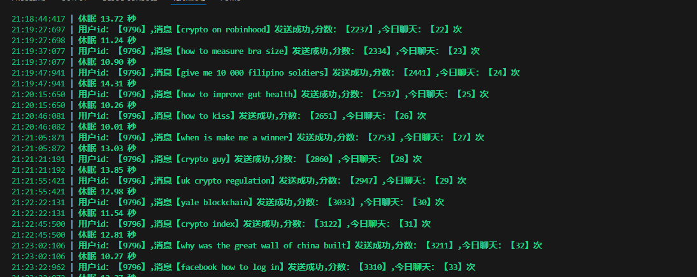

# Di-bot
多线程，代理自动聊天

邀请码： WVBLMEFNCF  MZ8KMQOMJ7  2KEBRSOBQ0  PWGFM02E8P  XIM2BAF03E ZK3YPOODDV

Clone the Repository  克隆存储库

    git clone https://github.com/yizhitiehanhan/Di-bot.git

Install Dependencies  安装依赖项

    pip install -r requirements.txt
    

token.txt 

    # token----proxy
    
    #  example  例子如下
    
    # ey..----http://127.0.0.1:42002
    

启动机器人：

     python bot.py
  
    

   

